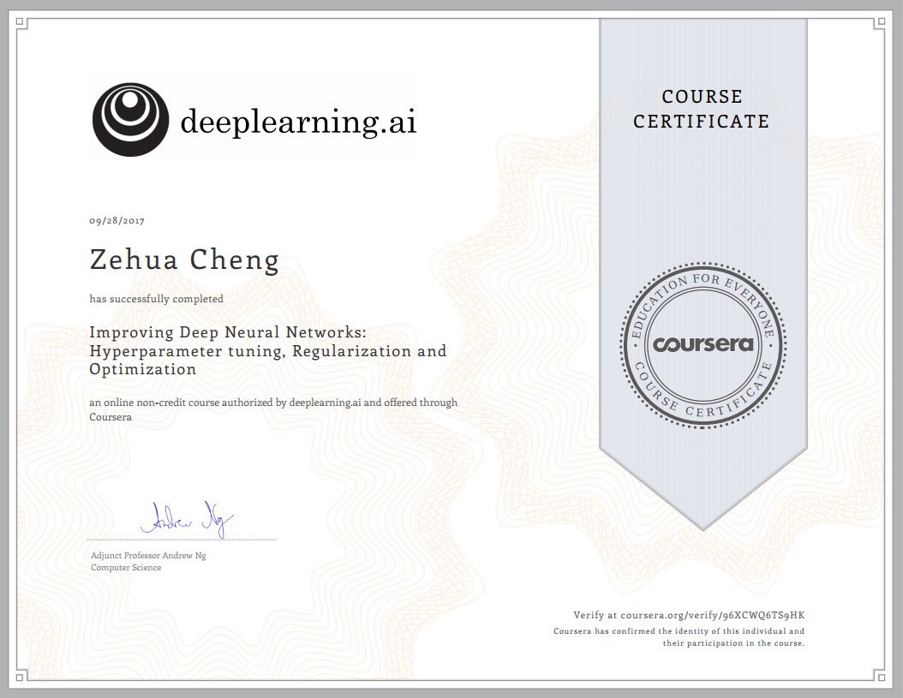

# Data Science Certificate
Personal Certificate Set.

## Statistics

### Bayesian Statistics: From Concept to Data Analysis(with honors)

## Data Mining

### Introduction to Data Science in Python

### Pattern Discovery in Data Mining

## Machine Learning

### Applied Machine Learning in Python

## Deep Learning

### Neural Networks and Deep Learning

### Improving Deep Neural Networks: Hyperparameter tuning, Regularization and Optimization

### Structuring Machine Learning Projects

## Algorithm

### Divide and Conquer, Sorting and Searching, and Randomized Algorithms

### Graph Search, Shortest Paths, and Data Structures

### Greedy Algorithms, Minimum Spanning Trees, and Dynamic Programming

### Probabilistic Graphical Models 2: Inference(With Honour)

