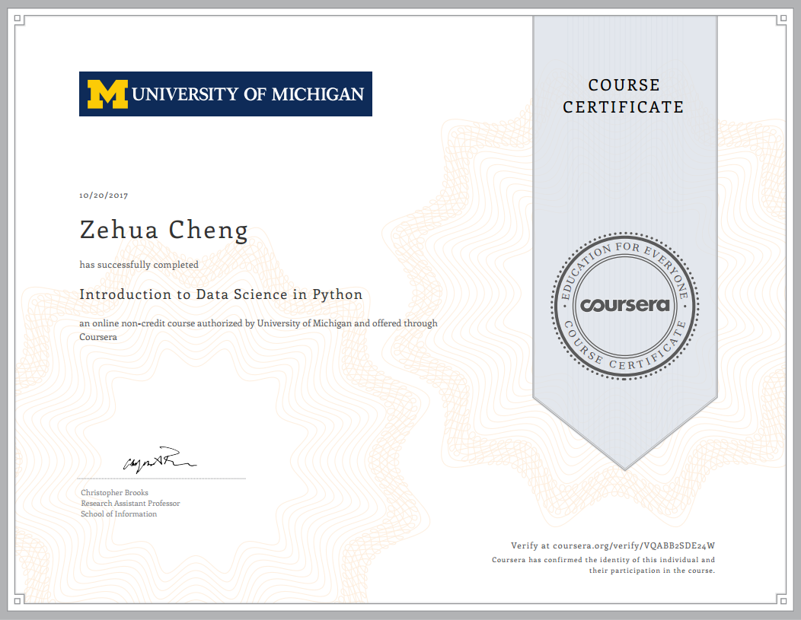
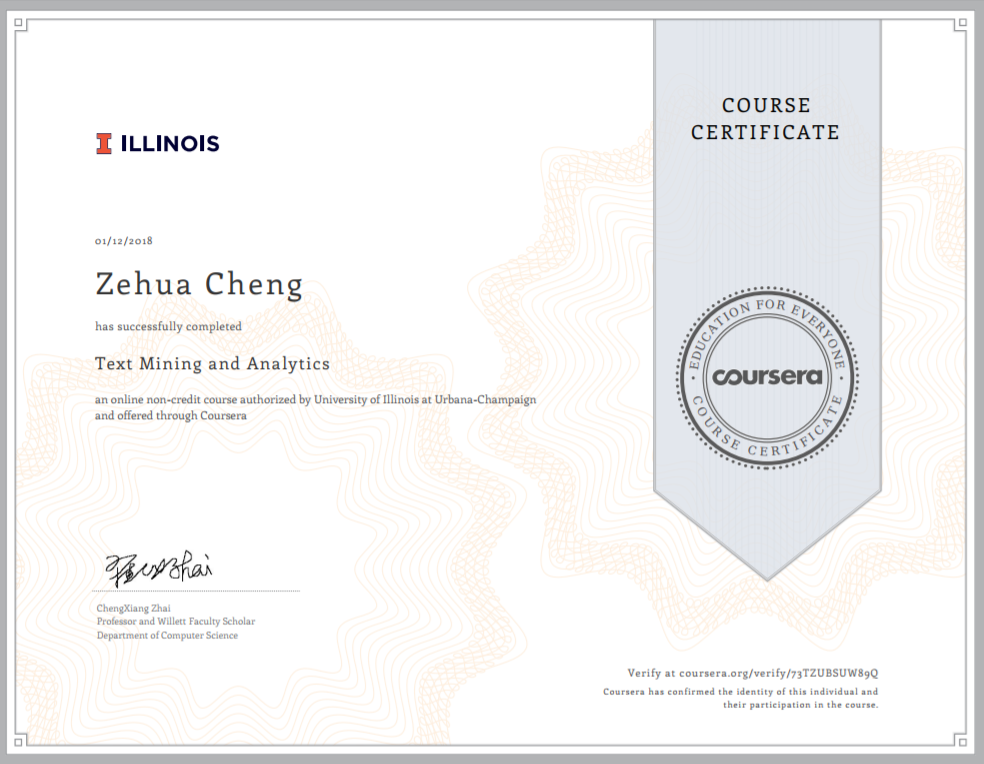
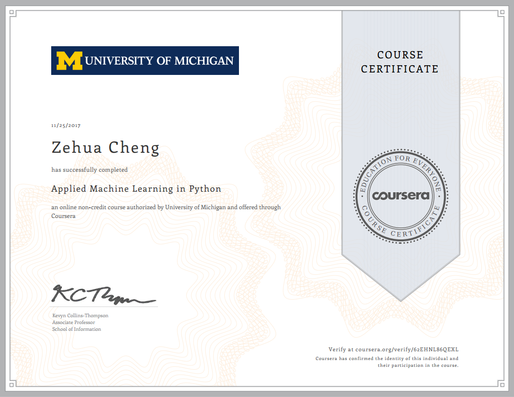
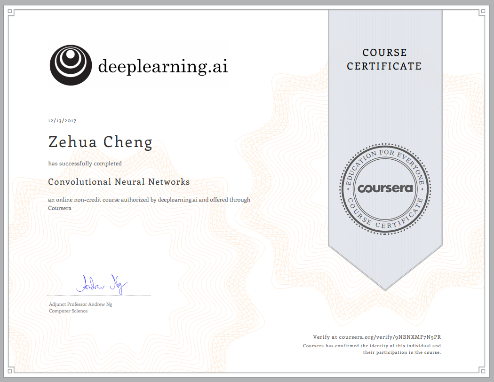
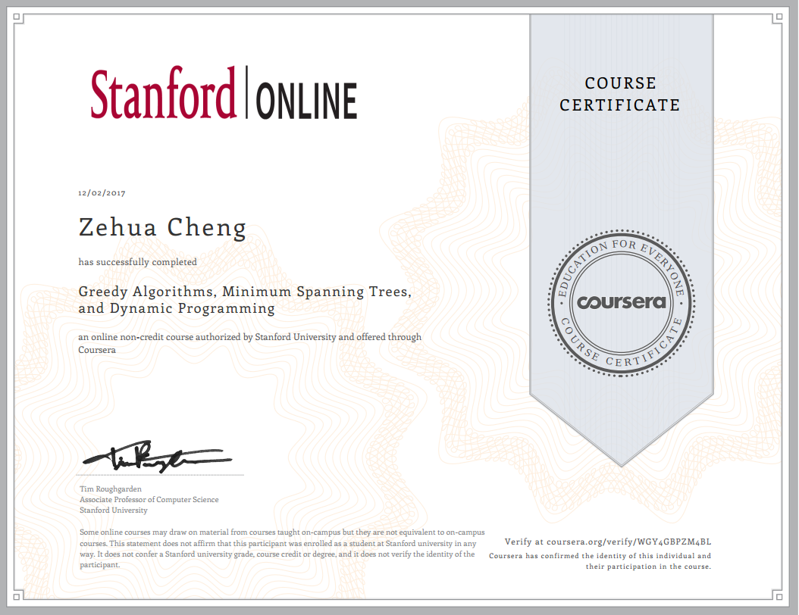
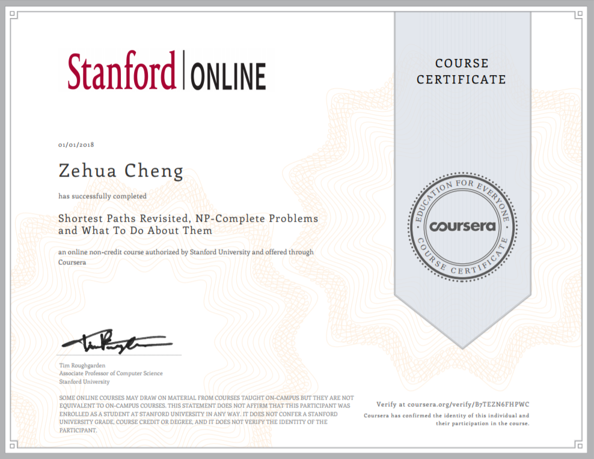
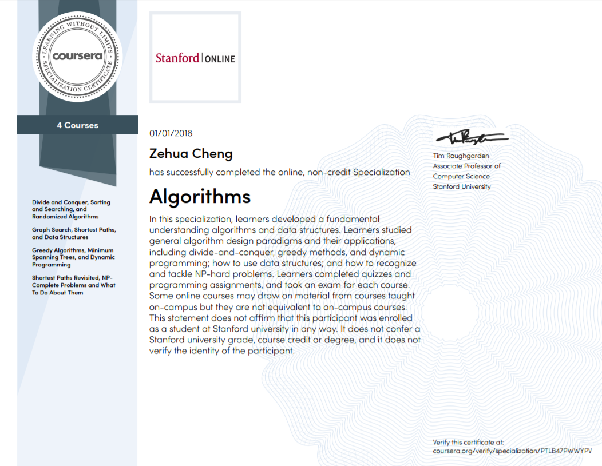
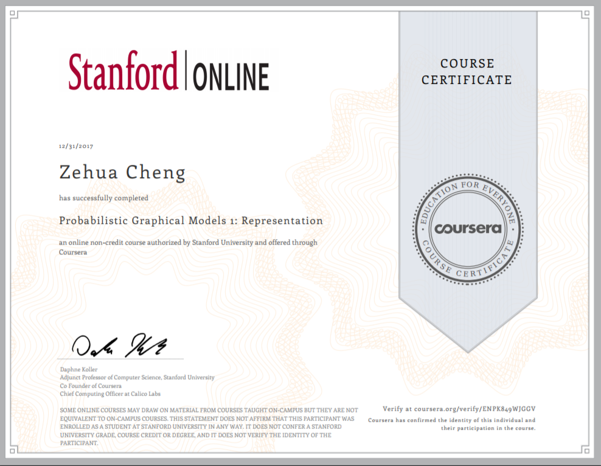
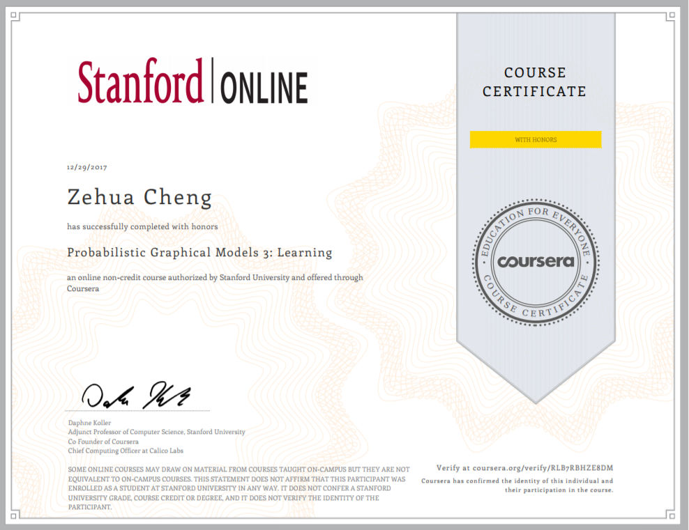
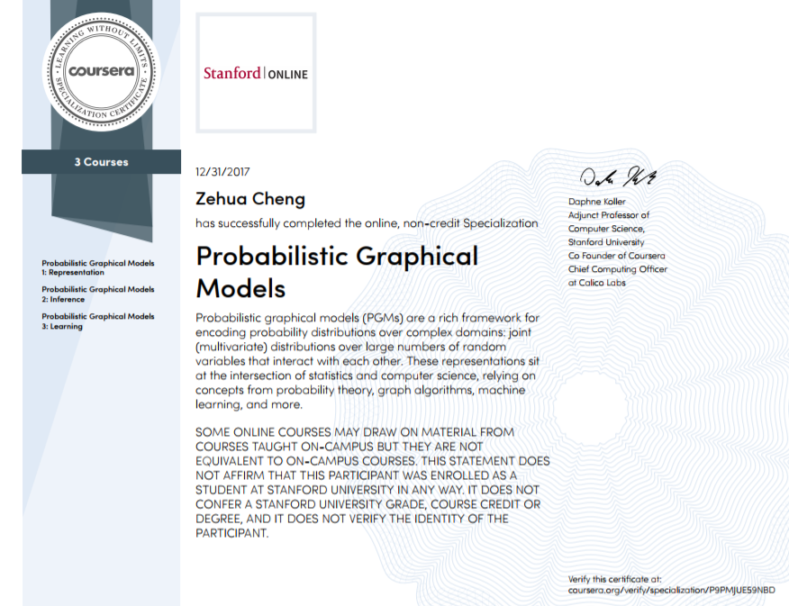

# Data Science Certificate
Personal Certificate Set about data science.

## Udacity Data Analyst Specialization

During this specialization, I have learned:

1. **Introduction to Python**. Finished project: [Bay Area Bike Share Analysis](https://github.com/LimberenceCheng/Udacity-DAND-Graduated/blob/master/P0/Bay_Area_Bike_Share_Analysis.ipynb)
2. **Introduction to statistics**. Finished project: [Stroop_Effect_Analysis](https://github.com/LimberenceCheng/Udacity-DAND-Graduated/blob/master/P1/Stroop_Effect_Analysis.ipynb)
3. **Investigate a Dataset** Finished project: [Investigate a Dataset](https://github.com/LimberenceCheng/Udacity-DAND-Graduated/blob/master/P2/Investigate%20a%20Dataset.ipynb)
4. **Data Wrangling with MongoDB**Finished project: [MongoDB for data analysis](https://github.com/LimberenceCheng/Udacity-DAND-Graduated/blob/master/P3/MongoDB%20For%20Data%20Analysis.ipynb)
5. **Data Science with R**. Finished project:[Analysis Red Wine Quality](https://github.com/LimberenceCheng/Udacity-DAND-Graduated/blob/master/P4/wineQualityReds.rmd)
6. **Intro to Machine Learning**Finished project: [Identify Fraud From Enron Email](https://github.com/LimberenceCheng/Udacity-DAND-Graduated/blob/master/P5/final%20project/Identify%20Fraud%20from%20Enron%20Email.ipynb)
7. **Data Visualization and D3.js**Finished project: [Data Visualization](https://github.com/LimberenceCheng/Udacity-DAND-Graduated/tree/master/p6)
8. **A/B testing** Finished project: [A/B Testing Udacity’s Free Trial Screener](https://github.com/LimberenceCheng/Udacity-DAND-Graduated/tree/master/p7)

## Tools

### Using Python to Access Web Data

## Statistics

### Bayesian Statistics: From Concept to Data Analysis(with honors)

## Data Mining

### Introduction to Data Science in Python

### Text Mining and Analytics

### Pattern Discovery in Data Mining

## Machine Learning

### Applied Machine Learning in Python

## Deep Learning

### Neural Networks and Deep Learning

### Improving Deep Neural Networks: Hyperparameter tuning, Regularization and Optimization

### Structuring Machine Learning Projects

### Convolutional Neural Networks

## Algorithm

### Divide and Conquer, Sorting and Searching, and Randomized Algorithms

### Graph Search, Shortest Paths, and Data Structures

### Greedy Algorithms, Minimum Spanning Trees, and Dynamic Programming

### Shortest Paths Revisited, NP-Complete Problems and What To Do About Them

### Algorithm Specialization

### Probabilistic Graphical Models 1: Representation

### Probabilistic Graphical Models 2: Inference(With Honour)

### Probabilistic Graphical Models 3: Learning(With Honour)

### Probabilistic Graphical Models Specialization

